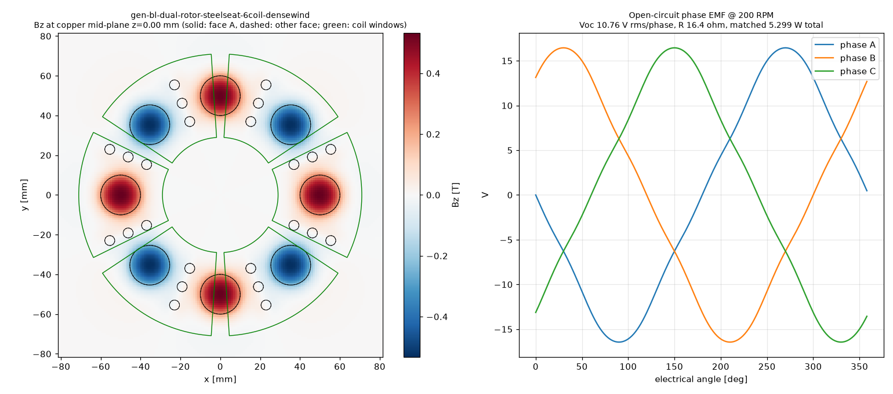

# Physics score — gen-bl-dual-rotor-steelseat-6coil-densewind

Scorer: `physics_scorer` (magpylib, N52 Br 1.43 T, PLA = air, 26 AWG copper at 20 °C). Topology **dual_rotor**, 8 poles, 6 coils x 1 stator(s). Verdict: **PASS**

## Headline @ 200 RPM (f_el 13.33 Hz)

| Metric | Value |
|---|---|
| Open-circuit phase voltage | **10.76 V rms** (16.45 V pk), line 18.57 V rms |
| Phase resistance | **16.4 Ω** @20 °C (19.0 Ω @60 °C) |
| Power into matched load (3 phases, P = V²/4R) | **5.299 W** (4.579 W hot) |
| Current at matched load / short-circuit | 0.328 A / 0.657 A per phase |
| Turns per coil (fit / claimed) | **566** / 566 (fit 566) |
| Peak |Bz| at copper mid-plane | 0.532 T |
| Mean |Bz| over coil window (aligned) | 0.102 T |
| Halbach Ø5 assist magnets | counted (diametric, tangential) |

Short-circuit note: air-core coil reactance at this frequency is negligible, so the short-circuit current is ≈ Voc/R (resistance-limited); it is self-limiting and safe for the machine, but there is no power delivered. Keep continuous coil current ≲ 0.5 A in printed formers (thermal). Matched load = load resistance equal to R_phase; copper loss then equals load power (50 % efficiency). A rectifier costs ~0.7–1.4 V per conduction path, which is a large fraction of these voltages — use Schottky diodes or series-connect more coils for charging.

## Winding fit

| Item | Value |
|---|---|
| Former | bobbin (windable) |
| Copper window | 8.10 mm axial x 17.10 mm radial build = 138.51 mm² |
| Copper boundary | r 29.00–71.00 mm, span 52.68° |
| Wire | OD 0.45 mm insulated, bare 0.4049 mm; fill assumption 0.65 (insulated-wire area / window) |
| Layers x max turns/layer | 18 x 38 |
| Fit (area / layer limit) | 566 / 684 → **566** |
| Copper fill achieved | 0.53 |
| Mean turn length | 107.8 mm |
| Wire per coil / total | 61.19 m / 367.2 m |
| Coil resistance | 8.193 Ω @20 °C |

## Electrical detail

- Peak flux linkage per coil: 88.3149 mWb-turn; coil EMF 5.380 V rms
- Phase grouping balanced: True, coils/phase {0: 2, 1: 2, 2: 2}, worst phasor error 0.0°
- Field per stator: {'S': {'peak': 0.5324, 'mean_window': 0.1023}}
- Axial stack (mm): {'recess': 0.09999999999999964, 'm2m': 10.7, 'mag_face_z': 5.449999999999999, 'wound_gap': 0.5999999999999996, 'copper_gap': 1.3999999999999995, 'mech_gap': 0.5}

## Checks

| Status | Check | Detail |
|---|---|---|
| PASS | rotor clocking | rotor B vs rotor A: offset 0 deg (pole pitch 45 deg), axis sign +1; fundamental clocking factor 1.000 (1.000 = magnets directly opposite, N facing S) |
| PASS | rotor keying | rotor bore has D-flat / clocking pins |
| PASS | brace pattern flip-symmetry | brace angles ['45', '135', '225', '315']; flipped copy matches (a facing rotor/stator is a flipped print; asymmetric holes force a wrong clocking) |
| PASS | turns fit | claimed 566 t, fit 566 t (18 layers x <= 38/layer in 8.10 x 17.10 mm window, fill 0.65) |
| PASS | former windable | bobbin: open perimeter, printed hub |
| PASS | wound-coil envelope gap | magnet face -> wound envelope 0.60 mm (as-built recess 0.10 mm), magnet -> actual copper 1.40 mm, rotor face -> former 0.50 mm |
| PASS | adjacent formers | clearance between neighbouring former footprints at r=29: 1.70 mm |
| PASS | rotor holes vs magnet pockets | no hole intersects a pocket |
| PASS | one-plate bed fit | one_plate_layout.stl bbox 407.9 x 408.0 x 29.6 mm (limit 410) |

## Notes

- WHAT-IF: steel back-iron disc behind each rotor's magnets, modelled by first-order images (infinite, unsaturated plate) -> optimistic upper bound.

