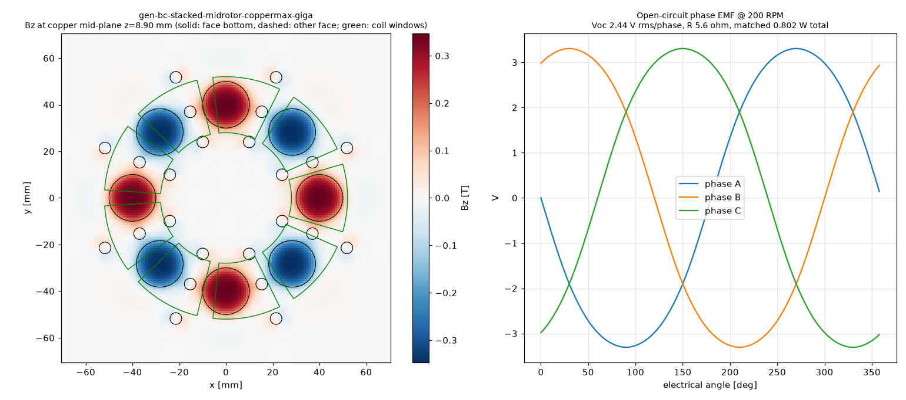

# Physics score — gen-bc-stacked-midrotor-coppermax-giga

Scorer: `physics_scorer` (magpylib, N52 Br 1.43 T, PLA = air, 26 AWG copper at 20 °C). Topology **mid_rotor**, 8 poles, 9 coils x 2 stator(s). Verdict: **PASS**

## Headline @ 200 RPM (f_el 13.33 Hz)

| Metric | Value |
|---|---|
| Open-circuit phase voltage | **2.44 V rms** (3.31 V pk), line 4.23 V rms |
| Phase resistance | **5.6 Ω** @20 °C (6.5 Ω @60 °C) |
| Power into matched load (3 phases, P = V²/4R) | **0.802 W** (0.693 W hot) |
| Current at matched load / short-circuit | 0.219 A / 0.437 A per phase |
| Turns per coil (fit / claimed) | **114** / 114 (fit 114) |
| Peak |Bz| at copper mid-plane | 0.337 T |
| Mean |Bz| over coil window (aligned) | 0.187 T |
| Halbach Ø5 assist magnets | counted (diametric, tangential) |

Short-circuit note: air-core coil reactance at this frequency is negligible, so the short-circuit current is ≈ Voc/R (resistance-limited); it is self-limiting and safe for the machine, but there is no power delivered. Keep continuous coil current ≲ 0.5 A in printed formers (thermal). Matched load = load resistance equal to R_phase; copper loss then equals load power (50 % efficiency). A rectifier costs ~0.7–1.4 V per conduction path, which is a large fraction of these voltages — use Schottky diodes or series-connect more coils for charging.

## Winding fit

| Item | Value |
|---|---|
| Former | bobbin (windable) |
| Copper window | 3.60 mm axial x 8.40 mm radial build = 30.24 mm² |
| Copper boundary | r 28.00–52.00 mm, span 32.42° |
| Wire | OD 0.45 mm insulated, bare 0.4049 mm; fill assumption 0.6 (insulated-wire area / window) |
| Layers x max turns/layer | 8 x 18 |
| Fit (area / layer limit) | 114 / 144 → **114** |
| Copper fill achieved | 0.48 |
| Mean turn length | 59.7 mm |
| Wire per coil / total | 6.96 m / 125.3 m |
| Coil resistance | 0.932 Ω @20 °C |

## Electrical detail

- Peak flux linkage per coil: 7.3516 mWb-turn; coil EMF 0.425 V rms
- Phase grouping balanced: True, coils/phase {0: 6, 1: 6, 2: 6}, worst phasor error 20.0°
- Field per stator: {'upper': {'peak': 0.337, 'mean_window': 0.1868}, 'lower': {'peak': 0.337, 'mean_window': 0.1868}}
- Axial stack (mm): {'recess': 0.20000000000000018, 'mag_face_z': 5.8, 'wound_gap': 0.7000000000000011, 'copper_gap': 1.3000000000000007, 'mech_gap': 0.5000000000000009, 'inter_magnet_web': 1.5999999999999996}

## Checks

| Status | Check | Detail |
|---|---|---|
| PASS | rotor clocking | mid-rotor -Z face vs +Z face: offset 0 deg (pole pitch 45 deg), axis sign +1; fundamental clocking factor 1.000 (1.000 = magnets directly opposite, N facing S / through-magnetised stack) |
| PASS | rotor keying | rotor bore has D-flat / clocking pins |
| PASS | brace pattern flip-symmetry | brace angles ['45', '135', '225', '315']; flipped copy matches (a facing rotor/stator is a flipped print; asymmetric holes force a wrong clocking) |
| PASS | turns fit | claimed 114 t, fit 114 t (8 layers x <= 18/layer in 3.60 x 8.40 mm window, fill 0.6) |
| PASS | former windable | bobbin: open perimeter, printed hub |
| PASS | wound-coil envelope gap | magnet face -> wound envelope 0.70 mm (as-built recess 0.20 mm), magnet -> actual copper 1.30 mm, rotor face -> former 0.50 mm |
| PASS | adjacent formers | clearance between neighbouring former footprints at r=28: 1.70 mm |
| PASS | rotor holes vs magnet pockets | no hole intersects a pocket |
| PASS | one-plate bed fit | one_plate_layout.stl bbox 408.5 x 409.0 x 21.2 mm (limit 410) |

