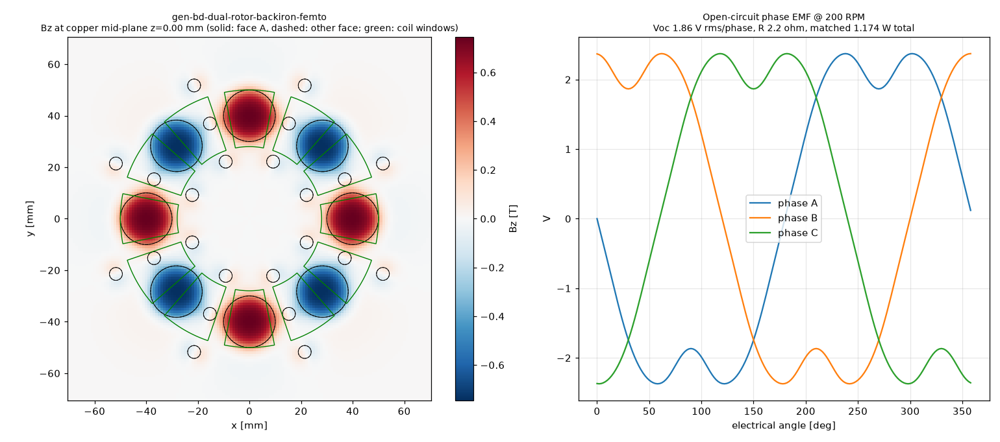

# Physics score — gen-bd-dual-rotor-backiron-femto

Scorer: `physics_scorer` (magpylib, N52 Br 1.43 T, PLA = air, 26 AWG copper at 20 °C). Topology **dual_rotor**, 8 poles, 12 coils x 1 stator(s). Verdict: **PASS**

## Headline @ 200 RPM (f_el 13.33 Hz)

| Metric | Value |
|---|---|
| Open-circuit phase voltage | **1.86 V rms** (2.37 V pk), line 3.15 V rms |
| Phase resistance | **2.2 Ω** @20 °C (2.5 Ω @60 °C) |
| Power into matched load (3 phases, P = V²/4R) | **1.174 W** (1.015 W hot) |
| Current at matched load / short-circuit | 0.422 A / 0.843 A per phase |
| Turns per coil (fit / claimed) | **76** / 76 (fit 76) |
| Peak |Bz| at copper mid-plane | 0.745 T |
| Mean |Bz| over coil window (aligned) | 0.534 T |
| Halbach Ø5 assist magnets | counted (diametric, tangential) |

Short-circuit note: air-core coil reactance at this frequency is negligible, so the short-circuit current is ≈ Voc/R (resistance-limited); it is self-limiting and safe for the machine, but there is no power delivered. Keep continuous coil current ≲ 0.5 A in printed formers (thermal). Matched load = load resistance equal to R_phase; copper loss then equals load power (50 % efficiency). A rectifier costs ~0.7–1.4 V per conduction path, which is a large fraction of these voltages — use Schottky diodes or series-connect more coils for charging.

## Winding fit

| Item | Value |
|---|---|
| Former | bobbin (windable) |
| Copper window | 3.60 mm axial x 5.60 mm radial build = 20.16 mm² |
| Copper boundary | r 28.00–50.00 mm, span 22.42° |
| Wire | OD 0.45 mm insulated, bare 0.4049 mm; fill assumption 0.6 (insulated-wire area / window) |
| Layers x max turns/layer | 8 x 12 |
| Fit (area / layer limit) | 76 / 96 → **76** |
| Copper fill achieved | 0.48 |
| Mean turn length | 52.1 mm |
| Wire per coil / total | 4.11 m / 49.3 m |
| Coil resistance | 0.551 Ω @20 °C |

## Electrical detail

- Peak flux linkage per coil: 8.1121 mWb-turn; coil EMF 0.464 V rms
- Phase grouping balanced: True, coils/phase {0: 4, 1: 4, 2: 4}, worst phasor error 0.0°
- Field per stator: {'S': {'peak': 0.745, 'mean_window': 0.534}}
- Axial stack (mm): {'recess': 0.20000000000000018, 'm2m': 5.8, 'mag_face_z': 3.1, 'wound_gap': 0.7000000000000002, 'copper_gap': 1.3, 'mech_gap': 0.5}

## Checks

| Status | Check | Detail |
|---|---|---|
| PASS | rotor clocking | rotor B vs rotor A: offset 0 deg (pole pitch 45 deg), axis sign +1; fundamental clocking factor 1.000 (1.000 = magnets directly opposite, N facing S) |
| PASS | rotor keying | rotor bore has D-flat / clocking pins |
| PASS | brace pattern flip-symmetry | brace angles ['45', '135', '225', '315']; flipped copy matches (a facing rotor/stator is a flipped print; asymmetric holes force a wrong clocking) |
| PASS | turns fit | claimed 76 t, fit 76 t (8 layers x <= 12/layer in 3.60 x 5.60 mm window, fill 0.6) |
| PASS | former windable | bobbin: open perimeter, printed hub |
| PASS | wound-coil envelope gap | magnet face -> wound envelope 0.70 mm (as-built recess 0.20 mm), magnet -> actual copper 1.30 mm, rotor face -> former 0.50 mm |
| PASS | adjacent formers | clearance between neighbouring former footprints at r=28: 1.70 mm |
| PASS | rotor holes vs magnet pockets | no hole intersects a pocket |
| PASS | one-plate bed fit | one_plate_layout.stl bbox 409.0 x 409.0 x 21.2 mm (limit 410) |

## Notes

- WHAT-IF: steel back-iron disc behind each rotor's magnets, modelled by first-order images (infinite, unsaturated plate) -> optimistic upper bound.

