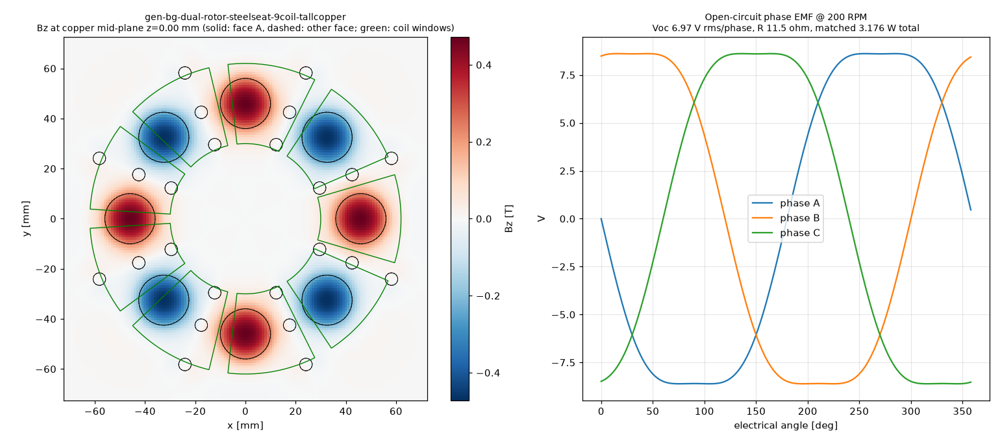

# Physics score — gen-bg-dual-rotor-steelseat-9coil-tallcopper

Scorer: `physics_scorer` (magpylib, N52 Br 1.43 T, PLA = air, 26 AWG copper at 20 °C). Topology **dual_rotor**, 8 poles, 9 coils x 1 stator(s). Verdict: **PASS**

## Headline @ 200 RPM (f_el 13.33 Hz)

| Metric | Value |
|---|---|
| Open-circuit phase voltage | **6.97 V rms** (8.61 V pk), line 11.98 V rms |
| Phase resistance | **11.5 Ω** @20 °C (13.3 Ω @60 °C) |
| Power into matched load (3 phases, P = V²/4R) | **3.176 W** (2.744 W hot) |
| Current at matched load / short-circuit | 0.304 A / 0.608 A per phase |
| Turns per coil (fit / claimed) | **364** / 364 (fit 364) |
| Peak |Bz| at copper mid-plane | 0.472 T |
| Mean |Bz| over coil window (aligned) | 0.193 T |
| Halbach Ø5 assist magnets | counted (diametric, tangential) |

Short-circuit note: air-core coil reactance at this frequency is negligible, so the short-circuit current is ≈ Voc/R (resistance-limited); it is self-limiting and safe for the machine, but there is no power delivered. Keep continuous coil current ≲ 0.5 A in printed formers (thermal). Matched load = load resistance equal to R_phase; copper loss then equals load power (50 % efficiency). A rectifier costs ~0.7–1.4 V per conduction path, which is a large fraction of these voltages — use Schottky diodes or series-connect more coils for charging.

## Winding fit

| Item | Value |
|---|---|
| Former | bobbin (windable) |
| Copper window | 9.90 mm axial x 9.75 mm radial build = 96.53 mm² |
| Copper boundary | r 30.00–62.00 mm, span 32.93° |
| Wire | OD 0.45 mm insulated, bare 0.4049 mm; fill assumption 0.6 (insulated-wire area / window) |
| Layers x max turns/layer | 22 x 21 |
| Fit (area / layer limit) | 364 / 462 → **364** |
| Copper fill achieved | 0.49 |
| Mean turn length | 78.0 mm |
| Wire per coil / total | 28.55 m / 257.0 m |
| Coil resistance | 3.823 Ω @20 °C |

## Electrical detail

- Peak flux linkage per coil: 42.8601 mWb-turn; coil EMF 2.439 V rms
- Phase grouping balanced: True, coils/phase {0: 3, 1: 3, 2: 3}, worst phasor error 20.0°
- Field per stator: {'S': {'peak': 0.4721, 'mean_window': 0.1933}}
- Axial stack (mm): {'recess': 0.09999999999999964, 'm2m': 12.5, 'mag_face_z': 6.35, 'wound_gap': 0.5999999999999996, 'copper_gap': 1.3999999999999995, 'mech_gap': 0.5}

## Checks

| Status | Check | Detail |
|---|---|---|
| PASS | rotor clocking | rotor B vs rotor A: offset 0 deg (pole pitch 45 deg), axis sign +1; fundamental clocking factor 1.000 (1.000 = magnets directly opposite, N facing S) |
| PASS | rotor keying | rotor bore has D-flat / clocking pins |
| PASS | brace pattern flip-symmetry | brace angles ['45', '135', '225', '315']; flipped copy matches (a facing rotor/stator is a flipped print; asymmetric holes force a wrong clocking) |
| PASS | turns fit | claimed 364 t, fit 364 t (22 layers x <= 21/layer in 9.90 x 9.75 mm window, fill 0.6) |
| PASS | former windable | bobbin: open perimeter, printed hub |
| PASS | wound-coil envelope gap | magnet face -> wound envelope 0.60 mm (as-built recess 0.10 mm), magnet -> actual copper 1.40 mm, rotor face -> former 0.50 mm |
| PASS | adjacent formers | clearance between neighbouring former footprints at r=30: 1.70 mm |
| PASS | rotor holes vs magnet pockets | no hole intersects a pocket |
| PASS | one-plate bed fit | one_plate_layout.stl bbox 409.0 x 409.0 x 27.6 mm (limit 410) |

## Notes

- WHAT-IF: steel back-iron disc behind each rotor's magnets, modelled by first-order images (infinite, unsaturated plate) -> optimistic upper bound.

