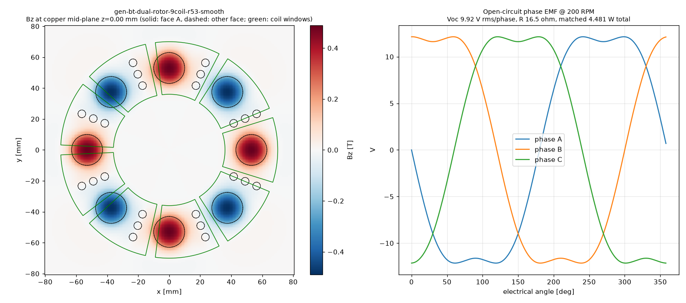

# Physics score — gen-bt-dual-rotor-9coil-r53-smooth

Scorer: `physics_scorer` (magpylib, N52 Br 1.43 T, PLA = air, 26 AWG copper at 20 °C). Topology **dual_rotor**, 8 poles, 9 coils x 1 stator(s). Verdict: **PASS**

## Headline @ 200 RPM (f_el 13.33 Hz)

| Metric | Value |
|---|---|
| Open-circuit phase voltage | **9.92 V rms** (12.14 V pk), line 16.99 V rms |
| Phase resistance | **16.5 Ω** @20 °C (19.1 Ω @60 °C) |
| Power into matched load (3 phases, P = V²/4R) | **4.481 W** (3.873 W hot) |
| Current at matched load / short-circuit | 0.301 A / 0.602 A per phase |
| Turns per coil (fit / claimed) | **521** / 521 (fit 521) |
| Peak |Bz| at copper mid-plane | 0.489 T |
| Mean |Bz| over coil window (aligned) | 0.159 T |
| Halbach Ø5 assist magnets | counted (diametric, tangential) |

Short-circuit note: air-core coil reactance at this frequency is negligible, so the short-circuit current is ≈ Voc/R (resistance-limited); it is self-limiting and safe for the machine, but there is no power delivered. Keep continuous coil current ≲ 0.5 A in printed formers (thermal). Matched load = load resistance equal to R_phase; copper loss then equals load power (50 % efficiency). A rectifier costs ~0.7–1.4 V per conduction path, which is a large fraction of these voltages — use Schottky diodes or series-connect more coils for charging.

## Winding fit

| Item | Value |
|---|---|
| Former | bobbin (windable) |
| Copper window | 9.45 mm axial x 13.50 mm radial build = 127.58 mm² |
| Copper boundary | r 36.00–70.00 mm, span 34.75° |
| Wire | OD 0.45 mm insulated, bare 0.4049 mm; fill assumption 0.65 (insulated-wire area / window) |
| Layers x max turns/layer | 21 x 30 |
| Fit (area / layer limit) | 521 / 630 → **521** |
| Copper fill achieved | 0.53 |
| Mean turn length | 78.4 mm |
| Wire per coil / total | 41.01 m / 369.1 m |
| Coil resistance | 5.491 Ω @20 °C |

## Electrical detail

- Peak flux linkage per coil: 61.1923 mWb-turn; coil EMF 3.489 V rms
- Phase grouping balanced: True, coils/phase {0: 3, 1: 3, 2: 3}, worst phasor error 20.0°
- Field per stator: {'S': {'peak': 0.4888, 'mean_window': 0.1587}}
- Axial stack (mm): {'recess': 0.0, 'm2m': 12.049999999999999, 'mag_face_z': 6.0249999999999995, 'wound_gap': 0.5, 'copper_gap': 1.2999999999999998, 'mech_gap': 0.5}

## Checks

| Status | Check | Detail |
|---|---|---|
| PASS | rotor clocking | rotor B vs rotor A: offset 0 deg (pole pitch 45 deg), axis sign +1; fundamental clocking factor 1.000 (1.000 = magnets directly opposite, N facing S) |
| PASS | rotor keying | rotor bore has D-flat / clocking pins |
| PASS | brace pattern flip-symmetry | brace angles ['45', '135', '225', '315']; flipped copy matches (a facing rotor/stator is a flipped print; asymmetric holes force a wrong clocking) |
| PASS | turns fit | claimed 521 t, fit 521 t (21 layers x <= 30/layer in 9.45 x 13.50 mm window, fill 0.65) |
| PASS | former windable | bobbin: open perimeter, printed hub |
| PASS | wound-coil envelope gap | magnet face -> wound envelope 0.50 mm (as-built recess 0.00 mm), magnet -> actual copper 1.30 mm, rotor face -> former 0.50 mm |
| PASS | adjacent formers | clearance between neighbouring former footprints at r=36: 1.70 mm |
| PASS | rotor holes vs magnet pockets | no hole intersects a pocket |
| PASS | one-plate bed fit | one_plate_layout.stl bbox 407.9 x 408.0 x 29.5 mm (limit 410) |

## Notes

- WHAT-IF: steel back-iron disc behind each rotor's magnets, modelled by first-order images (infinite, unsaturated plate) -> optimistic upper bound.

